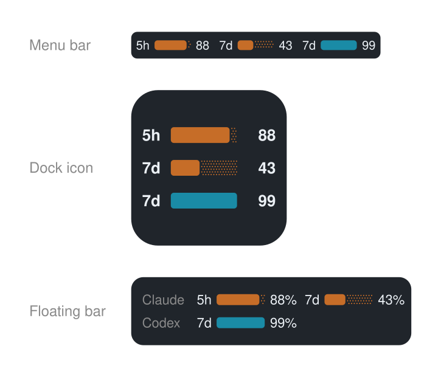

🇬🇧 [English](README.md) · 🇯🇵 [日本語](README.ja.md) · 🇪🇸 [Español](README.es.md) · 🇸🇦 [العربية](README.ar.md) · 🇫🇷 [Français](README.fr.md) · 🇩🇪 [Deutsch](README.de.md) · 🇨🇳 [简体中文](README.zh.md) · 🇰🇷 [한국어](README.ko.md) · 🇧🇷 [Português](README.pt.md) · 🇳🇱 [Nederlands](README.nl.md) · 🇮🇹 [Italiano](README.it.md) · 🇻🇳 [Tiếng Việt](README.vi.md) · 🇮🇩 [Bahasa Indonesia](README.id.md) · 🇹🇭 ไทย

# 🎚️ AI Usage Barometer



## ⚡ การติดตั้ง — วางบรรทัดเดียวนี้ใน Terminal

```bash
/bin/bash -c "$(curl -fsSL https://raw.githubusercontent.com/taka-avantgarde/ai-usage-barometer/main/install-app.sh)"
```

นั่นคือแอป ไม่ต้องมี Homebrew ไม่ต้องมี Xcode ไม่ต้องมี SwiftBar ใช้ได้กับ macOS 13 ขึ้นไป เมื่อเปิดครั้งแรกจะถามว่าจะให้อยู่ตรงไหน — แถบเมนู ไอคอน Dock หรือแถบลอย — และเปลี่ยนใจได้ทุกเมื่อจากเมนูของมันเอง

ใช้ SwiftBar อยู่แล้ว หรืออยากให้อยู่ตรงนั้น? บรรทัดนี้จะติดตั้งเป็นปลั๊กอินแทน และจะติดตั้ง Homebrew กับ SwiftBar ให้เฉพาะเมื่อยังไม่มี รันซ้ำได้อย่างปลอดภัย จึงใช้บรรทัดเดียวกันนี้อัปเดตได้

```bash
/bin/bash -c "$(curl -fsSL https://raw.githubusercontent.com/taka-avantgarde/ai-usage-barometer/main/install.sh)"
```

## รายการเดียวบนแถบเมนู

Claude และ Codex ใช้รายการเดียวร่วมกัน คั่นด้วยเส้นบาง แถบเป็นแบบแบตเตอรี่: **ส่วนที่เติมคือปริมาณคงเหลือ** ส่วนที่เป็นจุดคือที่ใช้ไปแล้ว เปอร์เซ็นต์ก็คือส่วนที่เหลือเช่นกัน

```text
5h ███░·  7d ██░░·  │  7d ████·
└──── Claude ────┘     └─ Codex ─┘
```

แถบเมนูวาดเป็นภาพเวกเตอร์ เพื่อให้แต่ละบริการคงสีของตนไว้ในรายการเดียว หากทำไม่ได้จะสลับไปใช้ข้อความธรรมดาโดยอัตโนมัติ

ทั้งสองพาเลตใช้สีอิ่มตัวและมีคอนทราสต์สูง: Claude ใช้สีส้ม และ Codex ใช้สีไซแอน
เมื่อเหลือ 11–30% สีเตือนจะผสมสีส้ม และเมื่อเหลือ 10% หรือน้อยกว่า
สีวิกฤตจะผสมสีแดงสด โดย Codex ยังคงส่วนผสมสีน้ำเงินที่ชัดเจนในทั้งสองระดับ:

| ระดับ | ใช้ไป | Claude | Codex |
|---|---:|---|---|
| ปกติ | 0–69% ใช้ไป |  `#C66D28` |  `#1A8BA6` |
| เตือน | 70–89% ใช้ไป |  `#B65A1E` |  `#52768A` |
| วิกฤต | 90–100% ใช้ไป |  `#C52E22` |  `#783F78` |

## การตั้งค่า

คลิกที่แถบแล้วเลือก **⚙ Display settings** แผงการตั้งค่าจะเปิดค้างไว้ เพื่อให้เปลี่ยนหลายตัวเลือกต่อเนื่องได้โดยไม่ต้องเปิดใหม่หลังทุกครั้ง และการเปลี่ยนแปลงมีผลทันที

หน้าจอของปลั๊กอินแสดงเป็นภาษาอังกฤษเท่านั้น ส่วนเอกสาร GitHub นี้ยังคงมีให้ใช้งานใน 14 ภาษา

| การตั้งค่า | ผล |
|---|---|
| แสดง Claude | แสดงหรือซ่อน Claude |
| แสดง Claude 5h | แสดงหรือซ่อนช่วง 5 ชั่วโมง |
| เปอร์เซ็นต์ของ Claude 5h | แสดงหรือซ่อนเปอร์เซ็นต์ของช่วงนี้ |
| แสดง Claude 7d | แสดงหรือซ่อนช่วง 7 วัน |
| เปอร์เซ็นต์ของ Claude 7d | แสดงหรือซ่อนเปอร์เซ็นต์ของช่วงนี้ |
| แสดง Codex | แสดงหรือซ่อน Codex |
| แสดงโควตา Codex ที่ 1 | แสดงหรือซ่อนโควตาแรกที่ Codex รายงาน |
| เปอร์เซ็นต์โควตา Codex ที่ 1 | แสดงหรือซ่อนเปอร์เซ็นต์ของโควตานี้ |
| แสดงโควตา Codex ที่ 2 | แสดงหรือซ่อนโควตาที่สอง ถ้ามี |
| เปอร์เซ็นต์โควตา Codex ที่ 2 | แสดงหรือซ่อนเปอร์เซ็นต์ของโควตานี้ |
| ช่วงการรีเฟรช | 1, 3 หรือ 5 นาที |

เมื่อซ่อนมาตรวัดทั้งหมด รายการกลาง `AI …` จะยังคงอยู่เพื่อเปิดการตั้งค่า สีพิจารณาจากแถบที่แสดงอยู่จริงเท่านั้น การตั้งค่าเก็บที่ `~/.cache/claude-codex-bar/` และคงอยู่หลังอัปเดต

เมื่อปิด Claude หรือ Codex ระบบจะหยุดอัปเดตข้อมูลของบริการนั้น การตั้งค่า 5h, 7d และเปอร์เซ็นต์ยังคงแสดงแบบจางและล็อกไว้ และจะคืนค่าเดิมเมื่อเปิดบริการอีกครั้ง

หากยกเลิกการเลือกทั้งช่วง 5h และ 7d ของบริการใด บริการและข้อผิดพลาดของบริการนั้นจะถูกซ่อนทั้งหมด และจะไม่มีการเรียกแหล่งข้อมูล

ปลั๊กอินตรวจ GitHub Releases ไม่เกินวันละครั้ง หากมีอัปเดตจากผู้ดูแล เมนูและการตั้งค่าจะแสดงการแจ้งเตือน บันทึกประจำรุ่น และปุ่ม **อัปเดตตอนนี้**

## แอป — เลือกได้ว่าจะให้อยู่ตรงไหน

แถบเมนูไม่ได้ใช้ได้เสมอไป บน Mac บางเครื่องรายการสถานะถูกวางไว้นอกจอและไม่ถูกวาดเลย
ส่วนข้าง ๆ รอยบากก็อาจไม่มีที่ว่างเลยจริง ๆ แอปจะวางมาตรวัดชุดเดียวกันนี้ไว้ในที่ที่คุณเลือก

| ตำแหน่ง | คืออะไร |
|---|---|
| **แถบเมนู** | รายการสถานะของแอปเอง แสดงบรรทัดเดียว |
| **ไอคอน Dock** | ตัวไอคอน Dock กลายเป็นมาตรวัด ไม่กินพื้นที่จอเลย |
| **แถบลอย** | แถบเล็ก ๆ ที่อยู่หน้าสุดเสมอ ลากไปวางตรงไหนก็ได้ |

ทั้งสามแบบเป็นอิสระต่อกัน เปิดผสมกันได้ตามต้องการ คลิกขวาที่แถบ ที่ไอคอน Dock
หรือที่รายการบนแถบเมนู เพื่อเปิดการตั้งค่า ได้แก่ เปิดปิดแต่ละบริการ เปอร์เซ็นต์
ตำแหน่งที่แสดง และ **Details…** สำหรับแผงที่มีเวลาคืนสภาพ

บรรทัดเดียวจบ ไม่ต้องมี Xcode ใช้ได้กับ macOS 13 ขึ้นไป

```bash
/bin/bash -c "$(curl -fsSL https://raw.githubusercontent.com/taka-avantgarde/ai-usage-barometer/main/install-app.sh)"
```

แอปผ่านการเซ็นรับรองและ notarize จาก Apple แล้ว จึงดาวน์โหลดมาเปิดได้ทันที ไม่มีคำเตือนและไม่ต้องคลิกขวา

หรือจะรันจากซอร์สก็ได้ วิธีนี้ต้องมี Xcode:

```bash
git clone https://github.com/taka-avantgarde/ai-usage-barometer.git
cd ai-usage-barometer/app && swift run
```

การตั้งค่าใช้ร่วมกับปลั๊กอิน SwiftBar จึงไม่มีทางแสดงไม่ตรงกัน

## แหล่งข้อมูล

**Claude** อ่านจากปลายทาง OAuth `api.anthropic.com/api/oauth/usage` โดยใช้โทเคนที่ Claude Code เก็บไว้แล้วใน Keychain ของ macOS (`Claude Code-credentials` หรือ `~/.claude/.credentials.json`) ไม่มีการเขียนลงทั้งสองที่ และโทเคนจะออกจากเครื่องเฉพาะในคำขอไปยัง Anthropic เมื่อรันครั้งแรกให้เลือก **อนุญาตเสมอ**

ผลลัพธ์ถูกแคชไว้ตลอดช่วงการรีเฟรช จึงเรียกปลายทางมากที่สุดหนึ่งครั้งต่อช่วง หากรีเฟรชล้มเหลว ค่าที่ถูกต้องล่าสุดจะยังคงแสดงอยู่

**Codex** อ่านจากตัวช่วยในเครื่อง `codex-usage.sh` ที่ตัวติดตั้งวางไว้ที่ `~/SwiftBar/.ai-usage-barometer/` โควตาของมันเป็นแบบไดนามิกทั้งจำนวนและชื่อ — การเปลี่ยนแพ็กเกจอาจทำให้ `5h`/`7d` กลายเป็นชื่ออย่าง `30d` — สวิตช์ทั้งสองด้านบนจึงอ้างอิงตามโควตาที่ 1 และที่ 2 ที่ Codex ส่งกลับมาจริง และแผงการตั้งค่าจะเปลี่ยนชื่อให้ตรงกันโดยอัตโนมัติ

## การแก้ปัญหา

**มีคำเตือนของ Claude** — เปิดเมนูแบบเลื่อนลงเพื่อดูสาเหตุ *Sign in to Claude Code again* หมายความว่าโทเคน OAuth หมดอายุแล้ว ให้เข้าสู่ระบบใหม่ผ่าน Claude Code CLI หรือส่วนขยาย IDE **นี่ไม่ใช่แอปเดสก์ท็อป Claude**: การเข้าสู่ระบบใน Claude.app จะไม่ต่ออายุโทเคนนี้ *Rate limited* จะหายไปเองเมื่อเวลาผ่านไป ปลั๊กอินจะรอ 15 นาทีและแสดงเวลาที่เหลือ

**มีคำเตือนของ Codex** — ไม่มีตัวช่วยหรือ Codex ยังไม่ได้สร้างข้อมูล ให้รันตัวติดตั้งอีกครั้งแล้วใช้ Codex CLI หนึ่งครั้ง

**สีบนแถบเมนูกับเมนูไม่ตรงกัน** — macOS อาจถือว่าแถบเมนูโปร่งแสงเป็นโหมดสว่างขณะที่เมนูเป็นโหมดมืด หากมี Python จะใช้การวาดเวกเตอร์สองสีเสมอ และจะใช้ข้อความสีเดียวเป็นทางเลือกสำรองเมื่อไม่มี Python เท่านั้น

## ถอนการติดตั้ง

```bash
curl -fsSL https://raw.githubusercontent.com/taka-avantgarde/ai-usage-barometer/main/uninstall.sh | bash
```

## สัญญาอนุญาต

[MIT](LICENSE) © 2026 Takayuki Miyano · Atlas Associates Inc.
